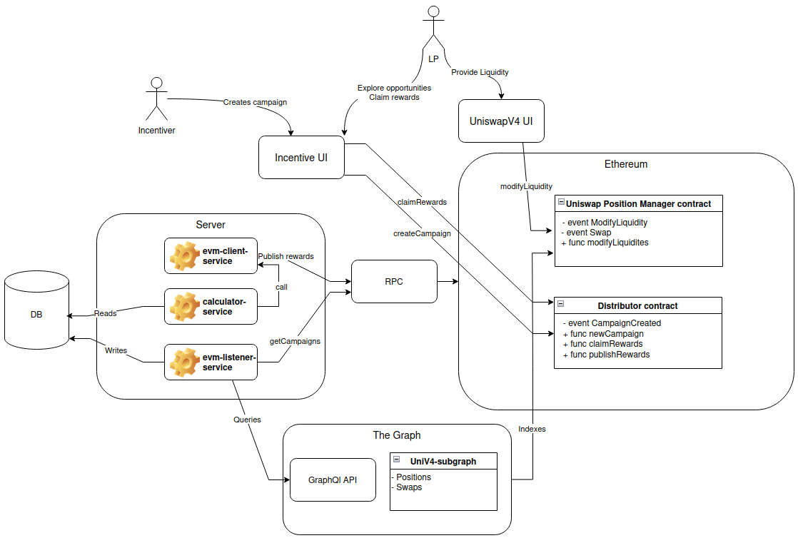

# UniswapV4 Indexing Engine

## Context

The purpose of this repo is to present the architecture and justify design choices as an answer to this [case study](https://anglemoney.notion.site/Uniswap-V4-Indexing-Engine-129cfed0d48c803fadf7c55b60a8c3a6).

Uniswap V4 will be released shortly; the goal of this exercise is to propose an architecture for an incentivization engine that will track participation in liquidity pool targeted by incentiver's campaigns. 

In the following we draft a proposal for the architecture. 

[This graphQl schema](/graphQl/uniswap-V4-shema.graphql), provided by [UniKits](https://github.com/UniKits-Dev) presents indexable uniswap V4 data to be queried trough a graphQl API and hosted on the Graph Decentralized network. 

[This request](./graphQl/get-positions.graphql) is a query to retrieve relevant position data of a given Uniswap V4 pool from a GraphQl API exposing data such as the one described in above schema.

[This other request](./graphQl/get-swaps.graphql) is a query to retrieve last swaps ona given uniswap V4 pool

[The prisma schema](./prisma/schema.prisma) is a draft of a schema to index the queried data and compute incentives

> **Note**: Those files are provided as illustrations and are not intended to be functionnal, working code


## UniV2 vs UniV3 vs UniV4

**Concentrated Liquidity**

In Uniswap V2 liquidity, was distributed all along the price curve given by $x*y=c$ where $x$ represents the reserves of token0, $y$ the reserves of token1 and $c$ a constant. 
Some pairs like stable coin pairs or flagship assets like BTC or ETH are not very volatile and thus usually trade in narrow price ranges.  
As a result, most of the liquidity of V2 pools remains unused and capital is inefficiently allocated.
To solve this issue, Uniswap V3 introduced the concept of concentrated liquidity. It allows LPs to provide liquidity in a specified price range, thus optimizing capital efficiency.
Mathematically, this changes a few things regarding how the pool data is represented on chain; 

Instead of a continuous price curve, Uniswap V3 discretizes the price space into small intervals called ticks. Each tick corresponds to a specific percentage change in price (0.01% or 1 basis point).
  
The price at a given tick $ t $ is defined as:

  $
  P_t = P_0 \cdot (1.0001)^t
  $

  where:
  - $ P_0 $ is the price at tick 0,
  - $ 1.0001 $ represents a 0.01% increase per tick,
  - $ t $ is the tick index.

  The use of $ 1.0001 $ ensures fine granularity in price movements, enabling LPs to place liquidity very precisely. This is especially useful for stablecoin pairs or assets trading in tight ranges.  

  Since prices are represented on-chain in their square root form, the square root price at tick $ t $ is:

  $
  \text{sqrtPrice}_t = \sqrt{P_t} = \sqrt{P_0} \cdot (1.0001)^{t/2}
  $

  This representation ensures efficient on-chain computations, as most operations (e.g., swaps, fee calculations) involve square root calculations rather than direct price manipulations.

**Non-Fungible Liquidity Positions**  

In Uniswap V2, liquidity positions were fungible and represented by ERC20 LP tokens because liquidity was uniformly distributed. In Uniswap V3, liquidity positions are non-fungible because each LP can specify a unique price range. These positions are represented as NFTs, where each NFT encodes:  
- The amount of liquidity provided,  
- The specified price range defined by lower and upper ticks.

**Inovations introduced by V4**

Uniswap V4 builds on the same liquidity and pricing model as introduced in Uniswap V3, including concentrated liquidity, price discretization using ticks, and square root price representation. As a result, the architecture presented in this document applies to both Uniswap V3 and V4 without significant changes.

However, Uniswap V4 introduces several key innovations, primarily focused on gas optimization and customizability, making it the most flexible and efficient version of Uniswap to date.

---

#### **Gas Optimizations**  

1. **Singleton Design**  
   Uniswap V4 replaces the factory-based model of V3 with a singleton contract. All pools are now deployed within a single contract rather than being instantiated as separate contracts. This drastically reduces gas costs associated with pool creation and interaction.  

2. **ERC-6909 Token Standard**  
   Instead of using ERC-1155 to represent liquidity positions, Uniswap V4 adopts the ERC-6909 token standard. ERC-6909 is more gas-efficient for managing tokenized positions while retaining the flexibility needed for non-fungible and fungible representations.  

3. **Flash Accounting**  
   Uniswap V4 leverages transient storage opcodes introduced by EIP-1153 to enable flash accounting. This optimization allows for temporary state storage within a transaction without incurring the costs of persistent storage. Flash accounting significantly reduces gas costs for operations like swaps, liquidity adjustments, and fee accounting.

---

#### Hooks: Customizable Pool Logic  

A groundbreaking feature introduced by Uniswap V4 is the concept of hooks. Hooks allow developers to attach arbitrary smart contract logic at specific points in a pool's lifecycle such as beforeSwap, afterSwap, beforeAddLiquidity, etc.

By enabling customizable execution logic, hooks open up a wide range of new use cases for liquidity pools. For example:  

- **Dynamic Fees**: Pools can implement adjustable swap fees based on factors such as reserves balance, trading volume, or market conditions.  
- **Custom Incentives**: Liquidity providers can be rewarded dynamically for specific behaviors (e.g., providing liquidity within certain ranges or at specific times).  
- **Automated Rebalancing**: Pools can trigger logic to rebalance liquidity or interact with other protocols (e.g., lending or yield farming).  

---

### Summary of Innovations  

| Feature                     | Description                                                                                 | Benefit                                 |
|-----------------------------|---------------------------------------------------------------------------------------------|-----------------------------------------|
| **Singleton Design**        | All pools live in a single contract.                                                       | Reduces gas costs for pool deployment.  |
| **ERC-6909**                | Optimized token standard for managing liquidity positions.                                 | Efficient handling of positions.        |
| **Flash Accounting**        | Uses transient storage (EIP-1153) for temporary state updates.                             | Significant gas savings on operations.  |
| **Hooks**                   | Allows arbitrary logic to execute at specific points (e.g., beforeSwap, afterSwap).         | Enables new use cases and flexibility.  |
| **Dynamic Fees**            | Adjusts swap fees dynamically based on pool conditions.                                    | Improves liquidity provider incentives. |

---
## Architecture overview

The purpose of this system is to enable incentive providers to encourage liquidity provision on specific UniswapV4 pools. To achieve this, incentive providers initiate liquidity campaigns, locking tokens as rewards for participants. Liquidity providers aiming to optimize their yield can join these campaigns by supplying liquidity to the designated pools. At regular intervals, the system calculates each provider's share of the rewards and publishes the results on-chain. Liquidity providers can then claim their allocated rewards.

### Global flow

The global flow is as follows: 

1. #### Campaign Creation

An incentivizer uses the Incentive UI to create a new campaign.  
They interact with the Distributor Contract on Ethereum to store the campaign details (e.g., targeted pools, reward amounts, duration, etc.) and lock the reward tokens.

2. #### Liquidity Provision

Liquidity Providers (LPs) explore the Incentive UI to find attractive reward opportunities.  
Once they identify a suitable campaign, they are redirected to the corresponding UniswapV4 pool interface.  
LPs then use the UniswapV4 UI to provide liquidity to the pool.

3. #### Reward Computation

At regular intervals, the system reads the blockchain to gather liquidity changes and swaps to calculate the rewards earned by each liquidity provider based on their share of the total liquidity in the targeted pool.  
The system determines each provider’s eligible share of the locked reward tokens and prepares this data for publication on-chain.

4. #### Reward Distribution

Liquidity Providers can view their accumulated rewards through the Incentive UI.  
To claim their rewards, LPs interact with the Distributor Contract, which releases their allocated tokens.  
This ensures that each participant receives their fair share of the rewards based on their contribution.

### Architecture diagram 

[UniV4IndexingEngine.drawio](https://drive.google.com/file/d/1HRVZh7YRvYfw0bufdwFvS6jNCuyiTvie/view?usp=sharing)



### Component review

#### Server 

The Server manages the entire reward computation process in a structured sequence that runs at regular intervals. During each execution, the evm-listener-service queries the UniswapV4 subgraph's GraphQL API to fetch relevant data such as liquidity positions and swaps. In order to remain efficient in terms of queries to the sub-graph the service filters only the relevant changes in liquidity and new swaps (see those graphQl queries [to get positions](./graphQl/get-positions.graphql) [or swaps](./graphQl/get-swaps.graphql)). The listener also fetches new campaigns from the Distributor contract via RPC calls. The listener then updates a database with this new data, ensuring an up-to-date state. (See prisma/schema.prisma). Once the database is updated, the calculator-service processes the data to compute rewards for each liquidity provider (LP) based on their activity and contribution to the relevant pools. After reward computations are complete, the evm-client-service publishes the calculated rewards on-chain by interacting with the Distributor Contract.

* Rationale:  
  The batch-based approach optimizes resource consumption by processing data in intervals rather than in real-time. Fetching events from The Graph allows the system to query structured data efficiently without the need for low-level RPC parsing or custom indexers.

#### Distributor Contract

The Distributor Contract is the on-chain component for storing campaign details, storing and distributing the reward tokens. In order to create a campaign, an incentive provider interacts with this contract by providing campaign details such as the targeted pools, reward amounts, and campaign duration as well as depositing an amount of tokens corresponding to the reward. The contract securely holds the reward tokens and registers campaign details. Once the campaign has started and that the server has processed a batch of swaps, it publishes the reward distribution to the distributor contract. This allows LPs to come and claim their rewards.

* Rationale:  
  The Distributor Contract acts as the source of truth for rewards, ensuring transparency and immutability. By storing rewards data on-chain, LPs have verifiable access to their entitlements without relying on off-chain systems for trust.

#### UniswapV4 Subgraph

The UniswapV4 Subgraph indexes all the data necessary to track liquidity and swaps to compute each LPs share of the rewards. It exposes this indexed data through a GraphQL API, which the server’s evm-listener-service queries during each batch execution to retrieve updates on liquidity positions and swaps. This data is efficiently retrieved by filtering only the latest updates with a block or time based condition as shown in [the graphQl schema](./graphQl/get-swaps.graphql).

* Rationale:  
  Since the system operates in batch mode rather than real-time, querying The Graph aligns perfectly with its requirements. The subgraph’s structured API simplifies data retrieval, allowing the server to fetch only the necessary data for processing.


## Distribution computation and Reward Formula

The reward distribution system operates by splitting the campaign into epochs, with each epoch representing a batch process of new positions and swaps tracked by the server.
We assume that the reward share for each LP should be proportionnal to the liquidity provider fees generated by the position during the epoch.
LP fees are collected when swaps occur within the range (tickLower, tickUpper) of a position. The more liquidity a position provides in the active range, the higher the fees generated. We can approximate rewards by tracking swap deltas (amount0Delta and amount1Delta) in relevant pools and positions.

**Steps to Compute Position Reward Shares**

1. Filter Relevant Swaps within the Block Range
    ```ts
    const relevantSwaps = await prisma.swap.findMany({
      where: {
        poolKey: campaignPoolKey, // The pool targeted by the campaign
        transaction: {
          blockNumber: { gte: startBlock, lte: endBlock },
        },
      },
      select: {
        id: true,
        sqrtPriceX96: true,
        tick: true,
        amount0Delta: true,
        amount1Delta: true,
        fee:true,
        createdAt: true,
      },
    });
    ```
2. Find Positions Overlapping with Each Swap
    ```ts
    const inRangePositions = await prisma.position.findMany({
      where: {
        poolKey: campaignPoolKey, // Same pool
        tickLower: { lte: swap.tick }, // Lower tick ≤ current tick
        tickUpper: { gte: swap.tick }, // Upper tick ≥ current tick
      },
      select: {
        id: true,
        liquidity: true,
        accountId: true,
      },
    });
    ```

3. Compute Fees for Each Position

    The fee for each position can be computed as:

    $
    \text{Position Fee Share} = \frac{\text{Position Liquidity}}{\text{Total Active Liquidity}} \times \text{Swap Fee Amount}
    $

    Given the swap fee tier, you can compute this for both `amount0Delta` and `amount1Delta`.

4. Aggregate Fees Across All Swaps

    For each position:
    Sum the fees collected across all relevant swaps during the block range.
    ```ts
      const positionFees = {}; // To store cumulative fees for positions

      relevantSwaps.forEach((swap) => {
        const activePositions = getPositionsInRange(swap.tick);

        const totalLiquidity = activePositions.reduce((sum, pos) => sum + BigInt(pos.liquidity), BigInt(0));

        const swapFeeAmount = BigInt(swap.amount0Delta + swap.amount1Delta) * BigInt(swap.fee) / BigInt(1e6); // Fee is usually in basis points (1e6 scaling)

        activePositions.forEach((position) => {
          const positionShare = (BigInt(position.liquidity) * swapFeeAmount) / totalLiquidity;

          if (!positionFees[position.id]) {
            positionFees[position.id] = BigInt(0);
          }

          positionFees[position.id] += positionShare;
        });
      });
    ```

5. Compute Reward Shares

    Once the total fees per position are known:
    Calculate each position's reward share based on its proportional fees relative to all positions.

    ```ts
    const totalFees = Object.values(positionFees).reduce((sum, fee) => sum + fee, BigInt(0));

    const positionRewards = Object.entries(positionFees).map(([positionId, fees]) => {
      const rewardShare = (fees * campaignRewardAmount) / totalFees;
      return { positionId, rewardShare };
    });

    ```
    The reward for each position can be computed as:

    $
    \text{Position Reward} = \frac{\text{Position Fees}}{\text{Total Fees Collected}} \times \text{Campaign Reward Amount Per epoch}
    $
